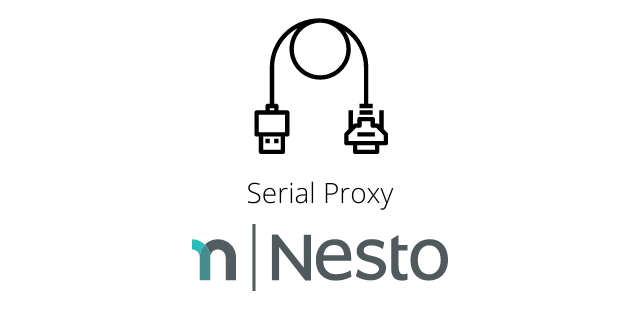

Serial Proxy for Raspberry Pi (armhf)   
========

<p align="center">
  
</p>

[](https://github.com/nesto-software/SerialProxy/actions/workflows/build.yml)
[](https://github.com/nesto-software/ProxySuite)


Heads Up!
------
This project is currently being refactored by Nesto.   
If you want to participate, feel free to reach out!   
For more information, please visit the [original README](./README).

Martin Löper `<martin.loeper@nesto-software.de>`

Development Status
------
<table>

  <tr><th>Variant</th><th>Status</th></tr>
  <tr><td>Software</td><td align="center">:heavy_check_mark:</td></tr>
  <tr><td>Hardware</td><td align="center">:heavy_check_mark: :warning:</td></tr>

</table>

The software variant runs without any known issues.   
The hardware variant which uses the <a href="https://www.keelog.com/serial-logger/">AirDrive Serial Logger</a> showed some major issues with health check protocols and high volume / continuous data streams. We are currently investigating these issues.

Both variants are covered by this codebase.

Install via GitHub Releases Download (binary)
---------------------------------------------

| Method    | Command                                                                                           |
|:----------|:--------------------------------------------------------------------------------------------------|
| **curl**  | `bash -c "$(curl -fsSL https://raw.githubusercontent.com/nesto-software/SerialProxy/master/scripts/install-from-release.sh)"` |
| **wget**  | `bash -c "$(wget -O- https://raw.githubusercontent.com/nesto-software/SerialProxy/master/scripts/install-from-release.sh)"`   |

Usage
-----

#### Software Proxy Approach

```bash
sudo sersniff -i /dev/ttyUSB0 -o /dev/ttyUSB1 -z -b 19200
```

#### Hardware Proxy Approach

```bash
sudo sersniff -i /dev/ttyACM0 -s -z
```

#### Alternative / Debugging

You can also proxy serial very easily using socat.   
Install it via `sudo apt-get install -y socat`.   
Use it for example to verify everything works as expected:

```bash
sudo socat -x /dev/ttyUSB0,raw,b19200 /dev/ttyUSB1,raw,b19200
```
